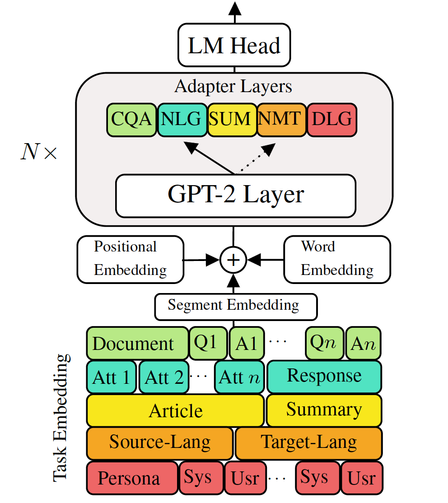

# Versatile Generative Language Model
 [](https://opensource.org/licenses/MIT) 


## Abstract
Fine-tuning pre-trained generative language models to down-stream language generation tasks have shown promising results. However, it comes with the cost of having a single, large, model for each task, which is not ideal in low-memory/power scenarios (e.g., mobile). In this work, we propose an effective way for fine-tuning multiple down-stream generation tasks simultaneously using a single, large pre-trained model. The experiments in five diverse language generation tasks show that by just using an additional 2-3% parameters for each task, our model can maintain or even improve the performance of fine-tuning the whole model.

## Versatile Generative Language Model (VLM):
<p align="center">

</p>
Versatile Language Model (VLM) is composed of three components: a pre-trained language model back-bone (e.g., GPT-2), and two kinds of specialized parameters for each generation task such as low-rank residual adapters and task embeddings.

## Dependency
Check the packages needed or simply run the command
```console
❱❱❱ pip install -r requirements.txt
```

## Experiments
***Dataset***

Download the preprocessed [**datasets**](https://drive.google.com/open?id=1Mv1GR8Z54M-BCAhRl5shaD2CHGYE2dVq)

***Reproducibility***

We provide the trained [**checkpoint**](https://drive.google.com/open?id=1E3aTZICLUNlwiEEaryStpX_HXoZeyNHK) of our VLM. 

Test model: choose one task from (mt, summarization, dialogue, qa, nlg].
```console
❱❱❱ python ./evaluate_vlm.py --task mt --no_sample --model_checkpoint $model_path
```

***Fine tune GPT-2***

Train machine translation:
```console
❱❱❱ python ./train.py --gradient_accumulation_steps=4 --max_history=2 --train_batch_size=8 --valid_batch_size=8 --n_epochs 8 --task mt --dataset_path data/NMT/data_en_ge.json
```

Test machine translation:
```console
❱❱❱ python ./evaluate.py --task mt --no_sample --max_history=2 --model_checkpoint runs/$model_checkpoint
```
Check run.sh to run other tasks

***VLM train Adapters and Task embeddings***

Train machine translation without knowledge distillation
```console
❱❱❱ python ./train.py --gradient_accumulation_steps=4 --max_history=2 --train_batch_size=8 --valid_batch_size=8 --n_epochs 8 --task mt --dataset_path data/NMT/data_en_ge.json --adapter_bottleneck 300 --lr 0.0005
```
Train machine translation using sentence level knowledge distillation:
```console
❱❱❱ python ./sentence_distiller.py --task mt --max_history=2 --model_checkpoint runs/$fully_finetuned_gpt2_checkpoint --no_sample
```
```console
❱❱❱ python ./train.py --gradient_accumulation_steps=4 --max_history=2 --train_batch_size=8 --valid_batch_size=8 --n_epochs 8 --task mt --dataset_path data/NMT/data_en_ge.json --adapter_bottleneck 300 --lr 0.0005 --distillation
```
Test machine traslation:
```console
❱❱❱ python ./evaluate.py --task mt --no_sample --adapter_bottleneck 300 --model_checkpoint runs/$model_checkpoint
```
Check run.sh to run other tasks

***Combine all the adapters and task embedding into single model***

Line 68 of combine_all.py to provide the list of checkpoint
```console
❱❱❱ python combine_all.py
```
Test to see if the result is same
```console
❱❱❱ python ./evaluate_vlm.py --task mt --no_sample --model_checkpoint $model_path
```
The above scripts illustrate how to train VLM continuously when tasks arrive sequentially.


***Multitask training VLM***

When all the tasks available at the same time.
```console
❱❱❱ python ./train_vlm.py --gradient_accumulation_steps=16 --train_batch_size=1 --valid_batch_size=1 --n_epochs 3
```


